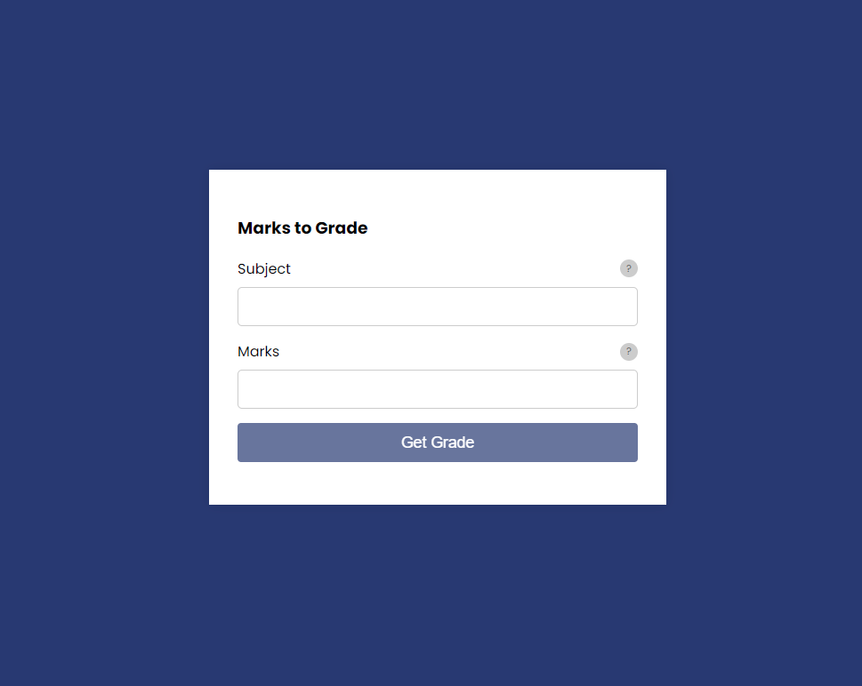

# Marks Grade Application Using JavaScript

yeah this is marks grade application using javascript. this application you can get a multiple subject grades to input multiple marks and subject in the particular fields. And also you will get a error message if any problem occure in the application and also you have to see some inforamtion button and many more.

## Using Technologies
- HTML5/HTML
- CSS3/CSS
- JavaScript
- VS Code Editor
- Git bash/ Github
many more..

# Demo screenshot about my projects 

;

> Thanks for reachout me on github